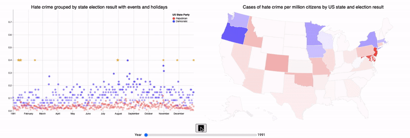

## Data Visualization Project

Visualizations created using Vega, a higher-level visualization specification language on top of D3, and D3. Group members Bert Van de Poel...

### The data
All visualizations are based on data provided by the Hate Crime Statistics Program of the FBI's Uniform Crime Reporting Program. It's important to keep in mind that the FBI data contains all instances of what was considered hate crime by the reporting officer. Depending on time, space and a lot of subjective aspects, an individual or an entire area's police force could be applying principles that hate crime has to be specifically and only motivated by hate or consider the use of a single racial slur as hate crime. While both are valid principles, this means that there are some effects within the data that are caused by differences in reporting principles within certain time periods or certain states or counties. The perception of race and racism, as well as what constitutes hate agaist a religion has changed across time. Hate crime against people with a non-heterosexual sexual orientation also went unreported during the 90s, keeping in mind that some states took until 2003 to decriminalize sexual acts between persons of the same sex. While these problems with the data should be kept in mind, they don't invalidate broad conclusions and visualizations, but make focusing on very specific points in time and space somewhat more problematic.

###  Time and space
These first two visuals represent hate crime across time for each state. The map on the left shows absolute numbers of hate crime, which of course over-emphasizes more populous states. The map on the right solves this issue by offsetting the amount of hate crime with the population (in million). As some states are very sparsely populated, both maps together paint a clearer picture. You can look at a specific year or slide through several years using the slider underneath the maps, or use the play button to automatically play through each year. If you are curious at the raw numbers or are unsure what state you're looking at, a handy tooltip can inform you further by hovering over the part of the map you're interested in. By default, all hate crime as aggregated, but it's also possible to look at certain kinds of hate crime by selecting a category from the dropdown menu. This will change both maps as well as the proportions, as some kinds of hate crime are more common or get reported more often.

### Politics, holidays and events
Clearly, politics and other events play a large role in the proliferation of hate crime. If 9/11 and legal progress for the LGBT community had such an impact on hate crime, it seems very relevant to look at what politics can cause, especially in times where some politicians openly support certain forms of discrimination. In the following two graphs, US election results were used to categorize states. On the left scatter plot, all states are grouped together based on their election result for each day of the year. The stars represent key events (larger stars) and holidays (smaller stars). When hovering across the stars, the event or holiday, the amount of hate crime and date is shown. Similarly, a tooltip with the date and amount of hate crime per million is displayed when hovering over the different dots. This same number is used for the y-axis of this graph. On the right, a similar map is shown to the previous two visualizations, however this time the colors are based on the election results. At the bottom, a year slider and play button make it easy to scroll through time and explore.

### Victims and offenders
Our first visualizations have shown us what kinds of hate crime are common, while the second group has clearly shown some effects of politics and events. This however doesn't really answer the question who are the people involved in these crimes. These four radar graphs show the distribution of victims and offenders across different races for the four main areas of the US.

### Cities
While we've largely looked at the macro level at states and the entire US, local insight can be very useful. This final visualization shows the top 10 US cities for hate crime throughout time. The color is based on the region the city is in. As numbers shift drastically across time, the axis will automatically adjust when playing with the year slider or using the automatic playback.

Link to vega online editor:

[red blue states](https://vega.github.io/editor/#/url/vega/N4IgJAzgxgFgpgWwIYgFwhgF0wBwqgegIDc4BzJAOjIEtMYBXAI0poHsDp5kTykSArJQBWENgDsQAGhAATONABONHJnaT0AQQAEsNorY4ANnHrbkObfJw0oa8WW0BVSgGVK2huMTG2ATwQ4cUxtRSRMBW0mP102L0wYmnFtACYABjSATkppEAB3Gll6NEyANjSZeBoyLDQBDJkkBkw2CBoALzg0EHEJLpk2snEkIwg0AG1QYcDugE04JEVc4hGGLtQARkzMjZkmJNk0UCScZu6wh36QBCS0LZ2ZZAAPNHSNgA4BiJw7gF9fgC6Mlk4RQqEmPSQM3QijgsiYRjWuQYiiM3SwuHwRDCeWodEYTAYEDgiigEgiwUoZIQBAAYkkIqi-AQACKg4mYCAAfRaXOMSD8XIK9AIyAgjIIsPhiLgQrYXO8uKgEGIuQAZvpkJgjiAEjh1iBlaqZDhFsTuk0Wrl5EYaDdGd0ZL8ZJgLhANYoEBNQHqDWqaEYHTI4E8cEt0CDMAwEJQ-AtFNoALyJ7TzRYgQHOqZQg3i8IKZGo7qR-hEgC0GzSMdEEnVmvCOt93RaODYNckMjVCyjsO6eYiY2durdHq94J9fn13SMbDYAGsGD9OwYxyApQikTI53A-N1CuqaHAjLIxuCQPugSAVjLT+MQPrSblTYoErl+7Lpld3yAAVndZO-QDIMQBDMNi3CaNKAfKBtAAQhTcQGCMNFM0vMM2zgOx1FvbNoXvAxhEwtRaxdACLSMJgSQgJwIBQQEBigEYC3HSE8LJGcllIqd0H0WQkhGa02GQW4zwAJTgU4EVsJAOxAFlEDYKAwjUKAfxkC4yHWO8AGI1QAZj03JtIMtUfz-T9ukMJAoDoXcuINW1vHTGROgMNBXTWYEhKQETQBLPtMHzMZO0PY9umgjN1JkzSJjSSg0hSKQNl-KRcIc8gglkLkjCQSi0XsyzFD44Z8rkbyRLvKVcg3LpLw0rSQHEyTbUY5J32CuSFKU8JbG0dqzMvExNPEE9vRAf1kO6dj9FyfRD2CbomDYbAhLLEw1W1F06BMbonFcbRXECiJtAABUWV9g3EMl5COf5L2QRQ5xw-9uJACAYCQKdlyEnV-PQfqhyCa71lAIIHVQH1Z0DFQdUGErumANRMBMVBI0g98FRzKRtAAcg+46lLtSIH3MANbQkHHUG0UdwgACjRmNoOxnG4oAFhxgBKX4MyHRdIxB8aydhxidvQabOMFo9DnQZ9XyHCajAAeVNGzXwht6RYNKzVbsyWwplklVKHcUDG3HVryRVBEOQ-5KjYUhw1AE35wFi2DW0gBhd5MgAIQAUR9yK3tdF2AHVCmKdW3bQPT-iHV0ZPdTUxqbdBNNaD6vvwjCsNrGWCKI9QM1-S8yXEf0yFu34gA)

